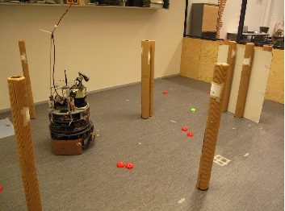
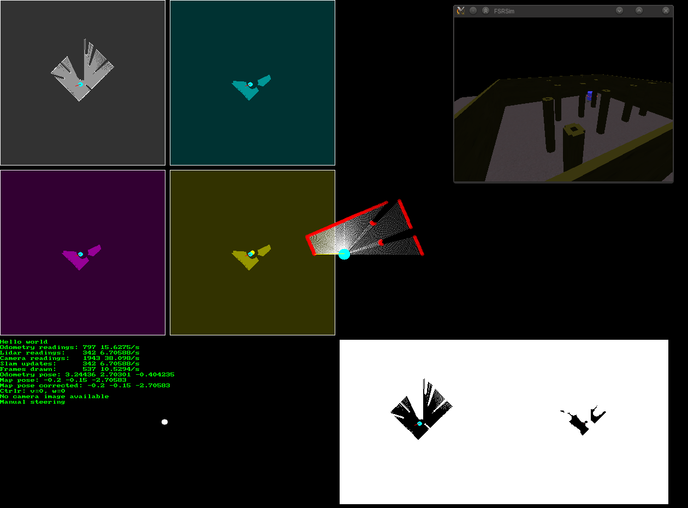

TaistellaAS - field and service robot AI
========================================

Another university robotics course project back in 2012. Control software for
an anonymous robot called J2B2, probably not quite alive anymore. The task of
the robot was to search and map an unknown indoor flat area to find interesting
objects and to bring them to a specified goal area, avoiding obstacles and
unwanted objects while moving. Requires a custom robot environment written in
the same automation systems lab. Stored in github for archival purposes.

http://sooda.dy.fi/2015/11/14/reliikki-4-8-tekoaly-puolipalloja-keraavalle-robotille-2012/
